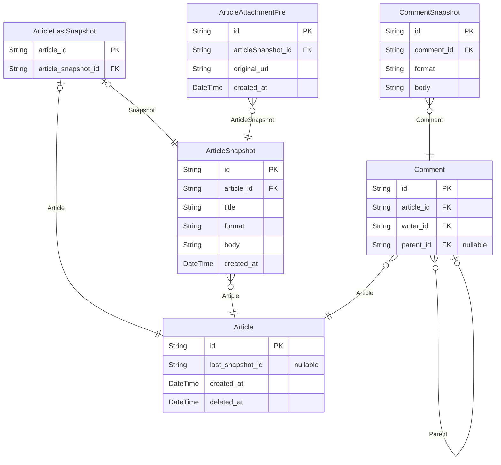
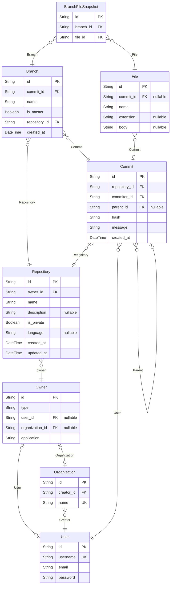

# Github
> Generated by [`prisma-markdown`](https://github.com/samchon/prisma-markdown)

- [Article](#article)
- [Repository](#repository)
- [Organization](#organization)
- [Interaction](#interaction)
- [Task](#task)

## Article

### `Article`
게시글

모든 게시글의 원형으로서 게시글의 Base가 된다.

**Properties**
  - `id`: ID
  - `last_snapshot_id`
    > 마지막 스냅샷 아이디
    > 
    > 마지막 스냅샷으로 바로 갈 수 있도록 아이디를 하나 더 걸어둔다.
    > 의도된 반 정규화이다.
  - `created_at`: 데이터가 생성된 시간
  - `deleted_at`: 

### `Comment`

**Properties**
  - `id`: 
  - `article_id`
    > 게시글의 아이디 
    > 
    > 게시글의 아이디로부터 게시글의 스냅샷을 가고, 어떤 내용인지 추적할 수 있게 된다.
  - `writer_id`: 작성자의 아이디
  - `parent_id`: 부모인 댓글이 있는 경우를 의미한다.

### `CommentSnapshot`

**Properties**
  - `id`: 
  - `comment_id`: 
  - `format`: 
  - `body`: 

### `ArticleLastSnapshot`

**Properties**
  - `article_id`: 
  - `article_snapshot_id`: 

### `ArticleSnapshot`

**Properties**
  - `id`: ID
  - `article_id`: 
  - `title`: 제목
  - `format`: 
  - `body`: 
  - `created_at`: 데이터가 생성된 시간이지만, Article 입장에서는 수정된 시간과 같다.

### `ArticleAttachmentFile`

**Properties**
  - `id`: ID
  - `articleSnapshot_id`: 
  - `original_url`: 파일의 URI
  - `created_at`: 

## Repository

### `Owner`
Owner

깃허브 상에서 `Owner`는 반드시 유저 마다 1개씩 존재하는 것이긴 하지만,
반드시 그것이 유저를 대상으로 한다고 말할 수는 없는 것이다.
때로는 유저가 아니라 Organization이 소유자일 수도 있다.

**Properties**
  - `id`: ID
  - `type`
    > Type of Owner
    > 
    > Owner의 타입을 의미한다.
    > 코드 저장소에서 Owner는 반드시 개인이 아니라 Organization일 수도 있기 때문이다.
    > 유저 아이디가 null인지 아닌지로 알 수 있는 내용이긴 하지만, 별도의 타입을 두어 구분한다.
  - `user_id`
    > ID of User
    > 
    > 만약 Repository의 소유자가 개인일 경우 user_id가 존재한다.
  - `organization_id`
    > ID of Organization
    > 
    > 만약 Repository의 소유자가 집단일 경우 user_id가 존재한다.
  - `application`
    > Application
    > 
    > 유저가 어떤 서비스에 가입했는지를 의미한다.
    > 여기서는 github, gitlab, gitbucket이 존재하며, 추후에 확장될 여지가 있다.

### `User`
User

Github에서의 유저를 의미한다.

**Properties**
  - `id`: ID
  - `username`
    > Username
    > 
    > 서비스에서의 사용자 이름
  - `email`
    > Email
    > 
    > 사용자의 이메일 주소
  - `password`
    > Password
    > 
    > Hash 알고리즘이 적용된 문자열을 의미한다.
    > 절대 평문으로 저장하지 않는다.

### `Repository`
Repository

깃허브의 레포지토리를 의미한다.

**Properties**
  - `id`: ID
  - `owner_id`
    > Owner ID
    > 
    > Repository를 소유한 Owner의 ID
  - `name`
    > Name of the Repository
    > 
    > 레포지토리의 이름
  - `description`
    > Description
    > 
    > 레포지토리 설명
  - `is_private`
    > Visibility of Repository
    > 
    > 레포지토리의 공개 여부
  - `language`
    > Primary Programming Language
    > 
    > 주요 언어
  - `created_at`
    > Created At
    > 
    > 레포지토리 생성 시간
  - `updated_at`
    > Last Updated At
    > 
    > Repository가 마지막으로 업데이트된 시간

### `Branch`
Branch

브랜치는 커밋에 사람이 인식할 수 있는 자연어 이름을 지정한 것을 의미한다.
따라서 브랜치는 어떠한 커밋에 이름을 붙였는지를 알기 위해 commit_id를 지닌다.
동일한 커밋 값에 여러 개의 브랜치를 생성하는 것 역시 가능하다.

**Properties**
  - `id`: ID
  - `commit_id`: 
  - `name`: Branch의 이름을 의미한다.
  - `is_master`
    > 마스터, 즉 메인 브랜치를 의미한다.
    > 
    > 이 칼럼이 True인 경우 Main 브랜치
  - `repository_id`: 
  - `created_at`: 데이터가 생성된 시간

### `BranchFileSnapshot`
Branch가 캐시한 파일 목록

각 커밋은 커밋으로 인해 변경된 파일만을 지닌다.
따라서 특정 시점에서의 전체 파일 목록을 조회하고자 하면 그 전까지의 커밋들을 순회하는 수 밖에 없다.
실제 Git의 구현은 위와 같지만, 이를 보다 성능 상 유리하게 만들��� 위해 브랜치에 한정하여 캐시를 하도록 한다.
브랜치는 해당 브랜치 이전에 만들어진 가장 최근 브랜치를 기준으로 삼아, 해당 브랜치로부터 나머지 커밋들을 순회하여 현 상태를 저장하게끔 한다.
이 캐시는 브랜치의 생성 시점을 기준으로 하며, 브랜치로부터 커밋이 추가로 생긴다면 다시금 순회를 시작해야 한다.

또한, 순회를 이용하든 일정 지점까지는 캐시를 이용하고 나머지만 순회하든, 결국 동일한 파일 목록이 나온다고 보장되어야 한다.

**Properties**
  - `id`: ID
  - `branch_id`: 캐시한 브랜치의 아이디
  - `file_id`: 캐시할 파일의 아이디를 의미한다.

### `Commit`
레포지토리 상에서의 변경 내역을 의미한다.

변경 내역은 `Commit` 이라고 하며 변경된 파일의 목록을 지닌다.
이 때, 변경 내역이 없을 수도 있는데, 이는 `Empty Commit` 이라고 하여 명시적으로 커밋한 경우이다.
이 경우를 제외하고는 `Files`는 반드시 1개 이상 존재해야 한다.

**Properties**
  - `id`: ID
  - `repository_id`: 
  - `commiter_id`: 커밋 자성자의 아이디
  - `parent_id`
    > 부모 커밋의 아이디
    > 
    > 커밋은 기본적으로 링크드리스트이며, 최초의 커밋 외에는 무조건 부모의 아이디를 가진다.
  - `hash`: 커밋을 가리킬 수 있는 Hash 값
  - `message`: 커밋 메시지
  - `created_at`: 데이터가 생성된 시간

### `File`
커밋이 변경한 파일

커밋이 변경한 파일은 body에 전체 파일 내용을 가지고 있어야 한다.
Github에서 `diff`를 보여주는 방식은 DB에 저장되는 것이 아니다.
파일의 변경 내역을 비교할 두 커밋은 무수한 조합이 가능하기 때문에 미리 DB에 저장하는 것이 불가능하다.

두 커밋을 가지고 `diff`를 구하고자 할 때, 이전 커밋이 LEFT로, 나중 커밋은 RIGHT로 지정되며 diff 알고리즘에 따른다.

**Properties**
  - `id`: ID
  - `commit_id`: 
  - `name`
    > 파일의 이름
    > 
    > 파일의 이름에는 path를 포함하고 있다.
  - `extension`
    > 파일의 확장자
    > 
    > 파일의 확장자는 파일의 이름으로부터 추출하되, 알 수 없는 경우가 있을 수도 있다.
    > 일반 텍스트 파일의 경우 `txt` 확장자이지만 그마저도 명시가 안된 경우가 있을 수 있어 null을 허용한다.
  - `body`: 파일의 내용물

## Organization

### `Organization`
Organization

**Properties**
  - `id`: ID
  - `creator_id`
    > Creator ID
    > 
    > 최초로 이 Organization을 만든 사람의 아이디를 의미한다.
    > 이 아이디가 있다고 해서, 이 사람만이 조직을 운영할 수 있는 것은 아니다.
  - `name`
    > name
    > 
    > 서비스에서의 조직 이름

### `Manager`
조직을 관리할 수 있는 매니저

Github에서는 하나의 조직을, 생성한 Owner 외에도 관리할 수 있을 뿐더러, Owner 를 다수로 지정할 수도 있다.
다수의 관리자들을 두는 경우, 여기서 Organization의 아이디와 User의 ID를 매핑하면 된다.

**Properties**
  - `id`: ID
  - `user_id`
    > User ID
    > 
    > 매니저로 지정될 유저의 아이디
  - `organization_id`
    > Organization ID 
    > 
    > 매니저가 지정될 조직의 아이디
  - `repository_id`
    > Organization ID 
    > 
    > 매니저가 지정될 조직의 아이디
  - `type`
    > 매니저의 권한
    > 
    > 매니저의 경우, Owner, Admin, Write, Read가 존재한다.
    > - Owner: 리포지토리의 모든 설정을 관리할 수 있는 권한으로 삭제 및 이동, 타 멤버의 권한을 조정하는 행위가 가능
    > - Admin: 레포지토리 설정을 관리할 수 있음
    > - Write: 레포지토리에 `Push`가 가능하다.
    > - Read: 코드를 읽을 수 있을 뿐, 코드 작성 뿐만 아니라 이슈나 PR 등의 생성 역시 불가능하다.
    > 
    > 단, Repository에 대해서는 소유자 외 다른 사람을 `Owner` 권한으로 할당할 수 없다.

## Interaction

### `Star`
Star

사용자가 레포지토리에 별점을 준 기록

**Properties**
  - `id`: ID

### `Base`
상호작용을 의미한다.

여기서의 상호작용은 코드 저장소인 Repository와 유저 사이의 상호작용이다.
스타를 누르거나 포크를 하는 등의 모든 상호작용을 Interaction이라고 하는데,
굳이 이를 Base Entity로 뺀 이유는 추후 어떠한 확장 요소가 생길지 모르기 때문이다.
이러한 확장성을 제외하고 생각한다면 Interaction에 type 칼럼을 두고 'star', 'fork'로 구분하는 것도 나쁘지 않다.

추후 사라질 수 있는 테이블이며, 이 경우 'fork'가 다른 방식으로 구현될 여지가 있기 때문이다.

**Properties**
  - `id`: ID
  - `repository_id`
    > Repository ID
    > 
    > 레포지토리의 ID
  - `user_id`
    > User ID
    > 
    > 사용자의 ID
  - `created_at`: 데이터가 생성된 시간

### `Fork`
Fork

사용자가 레포지토리를 포크한 기록

**Properties**
  - `id`: ID

## Task

### `Issue`
Issue

저장소에 작성한 이슈를 의미한다.
저장소의 이슈는 다른 작성자가 질문이나 버그 등 개발자에게 문제를 제기할 때 사용한다.
단순히 질문 용도로도 사용할 수 있으나, 이는 Owner가 명시한 내용에 맞춰 작성하는 것이 일반적이다.

**Properties**
  - `article_id`: 게시글 아이디로, 이 아이디를 통해서 이슈의 내용을 확인할 수 있다.
  - `user_id`: 이슈를 작성한 사람의 아이디

### `Assignee`
담당자 관계를 의미한다.

담당자를 가리키기 위한 관계 테이블이다.

**Properties**
  - `id`: 담당자의 아이디로, 유저의 아이디와 무관하게 담당 지정을 가리키기 위한 용도의 아이디
  - `issue_id`: 담당자로 정한 이슈
  - `user_id`
    > 담당해주길 원하는 사람의 아이디
    > 
    > 담당를 한다는 것은 최소한 이 사람의 권한이 Write 권한이라는 의미이다.
    > 이 때, 권한은 Organization, Repository에 따라 다를 수 있다.

### `PullRequest`
PR 혹은 Pull Request

어떤 커밋을 반영하고자 할 때, 개발자는 반영 요청을 하는데 이를 PR이라고 한다.
PR은 반영을 원하는 브랜치로부터 다른 브랜치 이름을 가리킨다.
브랜치는 커밋에 이름을 붙인, 일종의 변수명에 해당하지만,
그럼에도 PR에서는 커밋이 아닌 브랜치를 기준으로 해야 한다.

**Properties**
  - `article_id`: 게시글 아이디로, 이 아이디를 통해서 이슈의 내용을 확인할 수 있다.
  - `user_id`: 이슈를 작성한 사람의 아이디
  - `source_id`: 
  - `target_id`: 
  - `status`
    > PR의 상태
    > 
    > It must be one of: 'opened', 'closed', 'merged'
    > 논리적으로 하나의 source 브랜치로부터 다른 target 브랜치로의 PR은 1개만 존재 가능하다.
    > 따라서, 이미 열려있는 PR이 있는 경우 동일한 두 브랜치 사이 새로운 PR은 생성 불가하다.

### `Reviewer`
리뷰어 관계를 의미한다.

리뷰어를 가리키기 위한 관계 테이블이다.

**Properties**
  - `id`: 리뷰어의 아이디로, 유저의 아이디와 무관하게 리뷰 지정을 가리키기 위한 용도의 아이디
  - `pull_request_id`: 리뷰를 요청받은 PR의 아이디
  - `user_id`
    > 리뷰해주길 원하는 사람의 아이디
    > 
    > 리뷰를 한다는 것은 최소한 이 사람의 권한이 Write 권한이라는 의미이다.
    > 이 때, 권한은 Organization, Repository에 따라 다를 수 있다.

### `Task`

**Properties**
  - `article_id`: 
  - `user_id`: 
  - `number`
    > 태스크 넘버
    > 
    > 가리킬 수 있는 자연수 값으로, 1부터 시작한다.
    > 이슈나 PR을 작성할 때 # 기호 뒤에 숫자를 붙임으로써 이슈나 PR을 가리킬 수 있다.